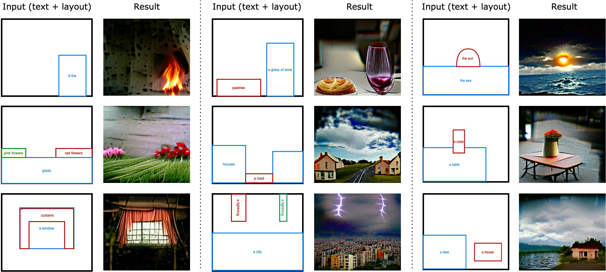
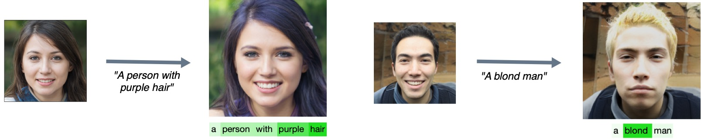
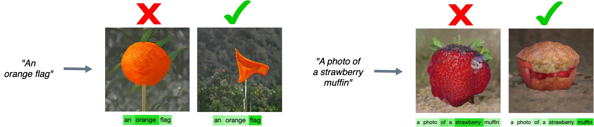

# [No Token Left Behind: Explainability-Aided Image Classification and Generation]

Official code release for the paper (https://arxiv.org/abs/2204.04908) 

## Usage

### 1. Notebook for spatially Conditioned Image Generation (VQGAN+CLIP)
<p align="left">
  
</p>
<a href="https://colab.research.google.com/github/apple/ml-no-token-left-behind/blob/main/notebooks/Explainability_aided_spatial_conditioning.ipynb">
  
</a>

### 2. Notebook for image Editing (StyleCLIP)
<p align="left">
  
</p>
<a href="https://colab.research.google.com/github/apple/ml-no-token-left-behind/blob/main/notebooks/Explainability_aided_image_manipulation.ipynb">
  
</a>

### 3. Notebook for image Generation (FuseDream)
<p align="left">
  
</p>
<a href="https://colab.research.google.com/github/apple/ml-no-token-left-behind/blob/main/notebooks/Explainability_aided_image_generation.ipynb">
  
</a>

### 4. Prompt Engineering running instructions

First, follow [DATASETS.md](external/CoOp/DATASETS.md) to install the datasets.
Create the required enviromnet with 
```
conda env create -f external/CoOp/dassl_env.yml
conda activate dassl
pip install torch==1.7.1+cu110 torchvision==0.8.2+cu110 -f https://download.pytorch.org/whl/torch_stable.html
```
Then clone and install dassl under 'external' direrctory:
```
cd external/Dassl.pytorch/
python setup.py develop
cd ../../
```

To run the experiment please run:
```
python external/CoOp/train.py --root <dataset_root> --trainer CoOp --dataset-config-file <dataset config file> --config-file external/CoOp/configs/trainers/CoOp/<base model>_ep50.yaml --output-dir <output_dir> --model-dir <model_dir> --seed 1 DATASET.NUM_SHOTS 1 TRAINER.COOP.EXPL_WEIGHT <expl_lambda> TRAINER.COOP.CSC False TRAINER.COOP.RETURN_EXPL_SCORE True TRAINER.COOP.CLASS_TOKEN_POSITION middle TRAINER.COOP.N_CTX 16
```

## Citation
```
@misc{Paiss2022NoTL,
  url = {https://arxiv.org/abs/2204.04908},
  author = {Paiss, Roni and Chefer, Hila and Wolf, Lior},
  title = {No Token Left Behind: Explainability-Aided Image Classification and Generation},
  publisher = {arXiv},
  year = {2022}
}
```
## Acknowledements
* Image manipulation code is based on [StyleCLIP](https://github.com/orpatashnik/StyleCLIP)
* Image generation code is based on [FuseDream](https://github.com/gnobitab/FuseDream)
* Image generation with spatial conditioning code is based on [VQGAN+CLIP](https://colab.research.google.com/drive/1ZAus_gn2RhTZWzOWUpPERNC0Q8OhZRTZ#scrollTo=VA1PHoJrRiK9) and [VQGAN](https://github.com/CompVis/taming-transformers)
* Prompt engineering code is based on [CoOp](https://github.com/KaiyangZhou/CoOp) and [Dassl](https://github.com/KaiyangZhou/Dassl.pytorch)
* Explainability method code is based on [Transformer-MM-Explainability](https://github.com/hila-chefer/Transformer-MM-Explainability)
## License
This sample code is released under the [LICENSE](LICENSE) terms.
